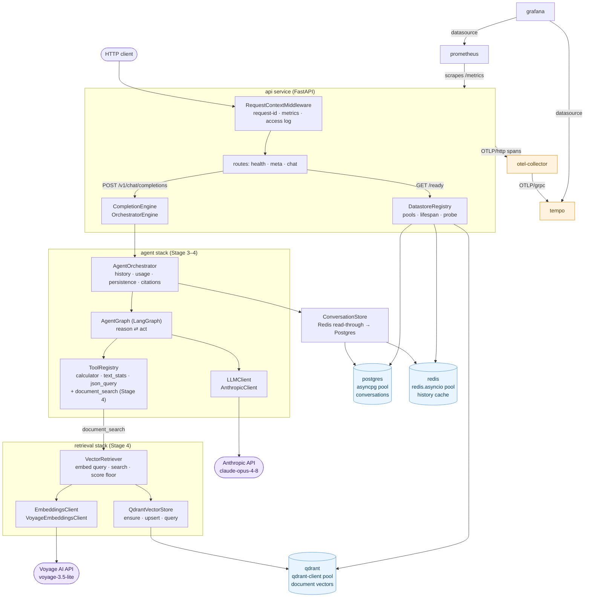
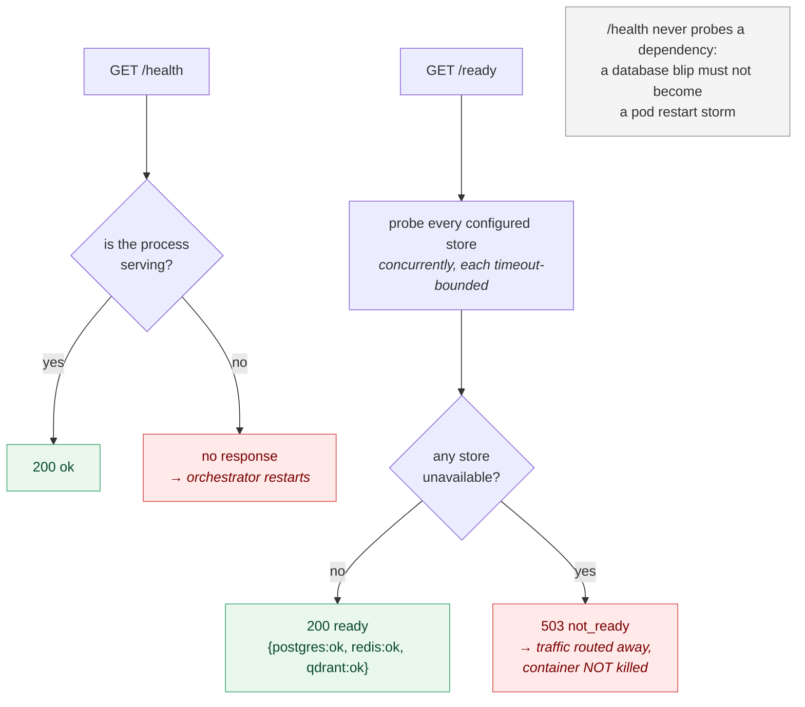
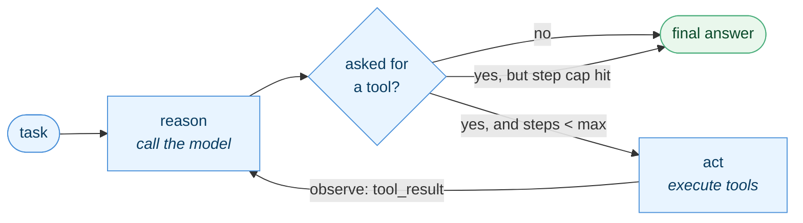
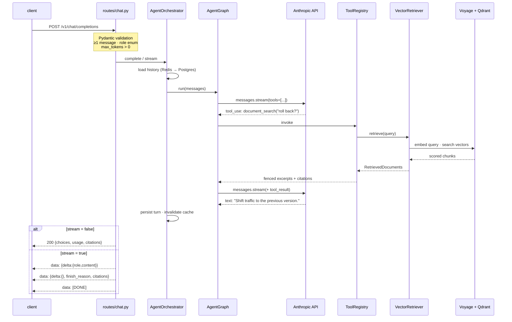
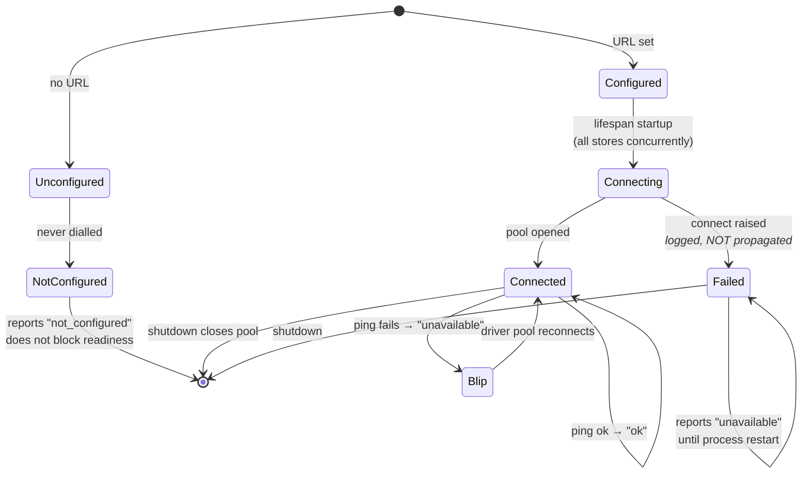
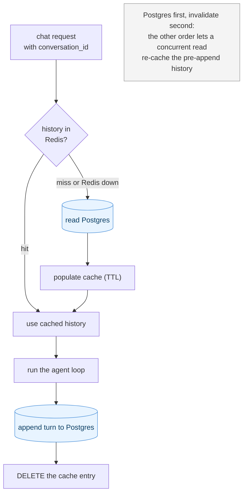
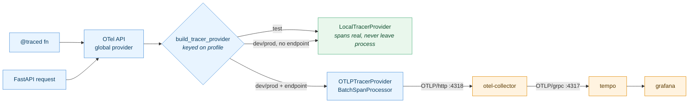

# Architecture

> **Reading rule for this document.** Everything under **Current state** exists
> and is tested today. Everything under **Planned** is **not yet implemented** —
> it is described as intent, not as built software. Do not infer capability from
> a folder existing.
>
> **This file is the source of truth.** `architecture.html` at the repo root is
> generated from it (`uv run python scripts/build_architecture.py`) and a test
> fails if the two drift. Edit this file, never the HTML. Diagrams are
> pre-rendered to inline SVG under `docs/diagrams/` — the page has no CDN and no
> JavaScript, and renders offline (ADR 0010).

**Stage 5 of 10 (Observability).** The platform is a FastAPI service whose chat
endpoint runs a **real LangGraph agent loop against the Anthropic API**: it
reasons, calls tools, observes the results, and answers — persisting the
conversation to Postgres behind a Redis read-through cache, and reporting the
model's own token counts. Stage 4 grounds those answers in documents: a corpus is
chunked and embedded (Voyage AI) into **Qdrant**, a `document_search` tool
retrieves relevant passages, and the response carries **citations** back to the
source chunks — retrieval is one more `Tool`, and the routes, SSE framing and
`CompletionEngine`/`LLMClient` seams are untouched.

**Stage 5 gives the `@traced` seam a real backend.** Since Stage 1 every
application function has carried `@traced`, logging enter/exit/error. It now also
emits a **real OpenTelemetry span**, and each HTTP request is a root span (FastAPI
auto-instrumentation) the `@traced` spans nest under. Spans export over OTLP/HTTP
to a new **OTel Collector** container, which forwards them to **Grafana Tempo**;
Grafana reads Tempo as a native datasource alongside Prometheus. **Not one of the
~30 `@traced` call sites changed** — the seam was built for exactly this. Metrics
stay on Prometheus (traces only through the collector — a deliberate scope cut,
ADR 0016).

**Stage 2's `EchoEngine` is gone.** The `CompletionEngine` protocol it sat behind
is unchanged, which is what let the Stage 3 swap happen without redesigning the
endpoint, let Stage 4 add grounding without touching it, and let Stage 5 add
tracing without touching any of it.

---

## Current state (Stage 6 — built and verified)

### Component map

Ingestion (`scripts/ingest.py`) is an **offline operator action**, not part of
the request path: it reads `data/corpus/`, chunks and embeds it, and upserts the
vectors into Qdrant. The `api` service never ingests — it only searches what
ingestion put there.

`shared/` (`config` · `logging` · `observability` · `datastores` · `migrations` ·
`version`) is imported throughout the service rather than sitting in the request
path — it is left out of the diagram above to keep the flow readable.

All three datastores now **hold real data**: Postgres the conversation history,
Redis its cache, and — new in Stage 4 — Qdrant the document vectors. The Stage 2
raw-`httpx` `/readyz` probe is gone; Qdrant is reached through `qdrant-client`,
and its readiness probe is now `get_collections()` (ADR 0012).

### The `api` service

| Endpoint | Purpose | Behaviour today |
|----------|---------|-----------------|
| `GET /health` | Liveness | `200` + service, version, environment. **Touches no datastore.** |
| `GET /ready` | Readiness | `200` `ready` + per-store checks; **`503` `not_ready`** if any configured store is unavailable |
| `GET /version` | Identity | `200` + service, version, environment |
| `GET /metrics` | Prometheus | request count + latency histogram |
| `GET /docs` | OpenAPI UI | generated by FastAPI |
| `POST /v1/chat/completions` | Chat | `200` completion, or an SSE stream when `"stream": true` |

**Request path:** `RequestContextMiddleware` assigns/propagates an
`X-Request-ID` (honouring an inbound header), binds it to a `ContextVar`, times
the request, records Prometheus metrics against the **route template** (not the
raw path, to bound label cardinality), echoes the id on the response, and emits a
structured access log.

**Error handling:** every failure returns one envelope —
`{"error": {"type", "message", "request_id"}}`. Handlers are registered for
`HTTPException` (Starlette's base, so unmatched-route 404s are covered),
`RequestValidationError` (422), and a catch-all `Exception` that logs the full
trace and returns a generic 500 that never leaks internals.

**Lifecycle:** an async `lifespan` logs `service.startup` / `service.shutdown`
and opens/closes the datastore pools.

### Liveness vs readiness

The distinction is load-bearing, not pedantry — see ADR 0005.

### The agent loop

Both transports run the **same** LangGraph graph, so streaming is a transport
choice and cannot change the answer. `reason` calls the model; `act` executes
every requested tool and feeds the results back; the loop ends when the model
answers instead of calling a tool, or when the step cap trips. See ADR 0006.

A tool that fails returns an `is_error` result rather than raising: the model
asked for something that did not work, and the useful response is to tell it so
it can correct itself — not to throw away a run the caller already paid for.

### Chat completion and streaming

SSE framing is specified in ADR 0004 and is **unchanged** from Stage 2. What
changed is `usage`: it now carries the model's own counts, summed across every
model call the run made.

The sequence below shows a **grounded** turn: the model calls `document_search`,
which embeds the query with Voyage and searches Qdrant, and the run answers from
the fenced excerpts. The citations accumulate in graph state and are surfaced on
the response (ADR 0013).

### Retrieval, grounding and citations (Stage 4)

Retrieval is composed as one more capability the agent can call, not a new loop.
`ToolRegistry.default()` still returns the three offline tools; the retrieval
tool is added at wiring time (`ToolRegistry.with_tools`, from `services.api.app`)
only when there is a live Qdrant to search. The dependency runs retrieval →
agents, so the agent kernel knows what a tool *is*, not what retrieval talks to.

| Piece | Module | Role |
|-------|--------|------|
| Ingestion | `services/retrieval/ingest.py` | `load_corpus` → `chunk_documents` (LlamaIndex `SentenceSplitter`) → embed → `upsert`. Offline; run by `scripts/ingest.py`. |
| Embeddings | `services/retrieval/embeddings.py` | `VoyageEmbeddingsClient`, and the offline `HashingEmbeddingsClient` the `test` profile runs — same hermetic guard as Anthropic (ADR 0009, 0011). |
| Vector store | `services/retrieval/store.py` | `QdrantVectorStore` on `qdrant-client`; deterministic UUIDv5 point ids make re-ingest idempotent (ADR 0012). |
| Retriever | `services/retrieval/retriever.py` | `VectorRetriever`: embed the query, search, drop matches below a score floor so an unrelated question returns nothing rather than weak noise. |
| Tool | `services/retrieval/tool.py` | `document_search`: the injection boundary. |

**Prompt-injection boundary (ADR 0014).** This is the first tool whose result is
not a pure function of its arguments — it returns document text that could be
attacker-influenced. Retrieved excerpts are fenced with a **per-call random
nonce** and labelled, next to the data, as untrusted reference material that must
not be obeyed as instructions. The nonce is unguessable, so a document cannot
close the fence and appear to break out into instruction context. This removes
ambiguity about what is data; it is **not** immunity, and the residual risk is
documented and deferred to Stage 8, which owns security.

**Citations (ADR 0013).** Retrieved chunks are carried out of the tool as typed
`Citation` data — never parsed back out of the text the model saw, so a document
cannot forge its own provenance. They accumulate across the run (deduplicated by
chunk id) and surface as a **new top-level `citations` field** on the response:
on the final SSE frame when streaming, once when whole. An ungrounded answer
reports `"citations": []` rather than omitting the field.

### `shared/` foundation

| Module | Responsibility |
|--------|----------------|
| `config.py` | Typed `Settings` (pydantic-settings), layered profiles — see ADR 0003. `prod` refuses to boot without all three datastore URLs, `ANTHROPIC_API_KEY`, *and* `VOYAGE_API_KEY` |
| `logging.py` | JSON formatter (`timestamp`, `level`, `service`, `environment`, `request_id`, `logger`, `message`, `exception`) + console formatter; routes uvicorn logs through one handler |
| `observability.py` | `@traced` — a structured DEBUG log **and** a real OpenTelemetry span (Stage 5) on enter/exit/duration/error; sync + async; PEP 695 typed. Imports the OTel **API** only, never the SDK, so `shared/` still never imports `services/` (ADR 0016) |
| `datastores.py` | `Datastore` ABC + Postgres/Redis/Qdrant implementations and `DatastoreRegistry` — see ADR 0005 |
| `migrations.py` | Forward-only raw-SQL migration runner, applied in the lifespan — see ADR 0007 |
| `version.py` | `__version__`, kept in sync with `pyproject.toml` by a test |

### Datastore lifecycle

Startup **never raises**: an unreachable store yields a diagnosable un-ready pod
rather than a crash loop. Connects run concurrently — serialised, three dead
stores delayed `/health` by ~20s (measured), long enough to trip a liveness probe
and cause the very crash loop the design avoids.

### Conversation state and caching

Postgres owns the data; Redis only ever holds a copy. Losing Redis costs latency,
never history. Writes **invalidate** the cache rather than rewriting it —
deleting cannot disagree with Postgres, whereas computing the new value twice
can. See ADR 0008.

A request **without** a `conversation_id` is stateless and touches neither store
— the Stage 2 contract (client sends the full history) still holds exactly.

**Schema** (`migrations/0001_conversations.sql`, applied on startup):

| Table | Purpose |
|-------|---------|
| `conversations` | One row per conversation: `id`, `created_at`, `updated_at` |
| `conversation_messages` | `conversation_id` -> `position` · `role` · `content`, unique on `(conversation_id, position)`, cascading delete |
| `schema_migrations` | Applied versions; what makes the runner idempotent |

### Tracing and the `@traced` seam (Stage 5)

`@traced` has sat on every application function since Stage 1. Stage 5 makes it
emit a real OpenTelemetry span alongside its DEBUG log, and wires the SDK — with
**not one call site changed**. The split that makes that possible:

- **`shared/observability.py`** imports the OTel **API** only and resolves its
  tracer through the global provider. Until something installs one, that provider
  is a no-op, so a script, an import or a unit test that never wires tracing emits
  nothing and dials nothing — the datastore rule again (ADR 0005).
- **`services/monitoring/tracing.py`** owns the **SDK**: it builds the provider,
  chooses the exporter, and installs it. `shared/` never imports `services/`, so
  the dependency arrow stays pointed the right way.

**Hermetic by construction — the third vendor (ADR 0016).** The provider is
chosen by the **profile**, not by whether a collector answers, exactly as for the
Anthropic (ADR 0009) and Voyage (ADR 0011) clients. `OTLPTracerProvider` *raises*
in its constructor under the `test` profile, before the endpoint is read, so no
test can dial the collector regardless of what is exported. `test` gets a
`LocalTracerProvider` whose spans are real but never leave the process — which is
what the in-memory-exporter span tests assert against, with no collector running.

**Not a `prod` boot requirement.** Unlike the datastore URLs and API keys, an
unset `OTEL_EXPORTER_OTLP_ENDPOINT` yields a service that runs untraced and logs
the fact — a trace backend is not worth refusing to serve traffic over. A dead
collector at runtime costs dropped spans (the `BatchSpanProcessor` drops and
logs), never a failed request.

**Span hygiene (ADR 0016).** Every span carries **exactly two attributes** —
`code.function` and `code.namespace` — both read off the function object at
decoration time, never from a call's arguments or return value. There is
structurally no path from wrapped-call data onto a span. On error the status
description is the exception **type name only**; the message stays in the recorded
event, not a searchable status. The rule against logging PII/secrets/queries/
excerpts applies to span attributes identically, because a span goes to Tempo.

### Infrastructure (Docker Compose)

`api` (built, non-root, multi-stage), `postgres`, `redis`, `qdrant`,
`prometheus` (scrapes `api:8000/metrics`), `grafana` (Prometheus **and Tempo**
datasources provisioned as code), and — new in Stage 5 — `otel-collector`
(OTLP receiver on 4317/4318, traces only) and `tempo` (single-binary, local
volume). Postgres and Redis gate `api` startup via healthchecks; the collector is
a `depends_on: service_started` only — the API must boot whether or not tracing
is up. Grafana is on host port **3001** (3000 collides with an unrelated local
container — see CLAUDE.md); Tempo's HTTP/search API is on **3200**.

Grafana ships one provisioned dashboard (`api-overview.json`: RED metrics from
Prometheus + three Tempo trace tables) and three symptom-level alert rules
(error rate > 5%, chat p99 > 30s, `/ready` 503) via Grafana-native unified
alerting — no Alertmanager container (ADR 0016).

### Evaluation and the regression gate (Stage 6)

The RAG retrieval pipeline has a real evaluation harness (`services/evaluation/`,
ADR 0017), run as an operator/CI script — `scripts/evaluate.py`, the same shape as
`scripts/ingest.py`, **never a service boot hook**. It has two tiers, split on the
same line ADR 0009/0011 draw: what cannot spend money blocks the build; what can,
never does.

- **Tier 1 — deterministic retrieval metrics (recall@k, MRR).** The `RetrievalEvaluator`
  grades a checked-in dataset (`data/eval/dataset.json`, query → expected
  document) over the shipped corpus using the **offline-hash embeddings** (ADR
  0011) and an in-memory brute-force **cosine store** — no Qdrant, no Voyage, no
  key, no network. It exits non-zero when a score drops below the checked-in
  baseline (`data/eval/baseline.json`) minus a tolerance. **This is a required,
  hermetic CI job (the `eval` job)** — the regression gate.
- **Tier 2 — LLM-as-judge** (answer faithfulness, citation accuracy). Real,
  billable Anthropic calls, so it is opt-in and double-gated exactly like the live
  contract test (ADR 0015): `RUN_LLM_JUDGE=1` **and** a key, built from a
  non-`test` profile, **never in CI**. Advisory — it does not gate.

The baseline is human-owned: a passing run never rewrites it, and raising the bar
is a deliberate `--update-baseline` action someone reviews (ADR 0017).

### Quality gate

ruff (lint + format) · mypy `strict` · pytest (311 tests, plus opt-in
live-datastore, live-Qdrant and live-provider layers that skip by default) ·
pre-commit · GitHub Actions running the same commands, **plus** the hermetic
Tier 1 eval regression gate (above) as a required job, **plus** a Docker job that
boots the container against live postgres/redis/qdrant service containers and
fails unless `/ready` reports every store `ok` and the chat + SSE contract holds.

The suite is **hermetic by construction**: the `test` profile cannot construct a
real Anthropic client *or a real Voyage client* — both refuse before their key is
read — so no test can make a paid API call regardless of what is in the
environment (ADR 0009, 0011). CI needs neither `ANTHROPIC_API_KEY` nor
`VOYAGE_API_KEY`. A separate, double-opt-in contract test (ADR 0015) makes one
real call to each provider when a human runs it deliberately.

---

## Planned — not yet implemented

Each item below is a **contract or empty folder only** today. The owning stage
builds it.

| Component | Stage | Status today |
|-----------|-------|--------------|
| `infrastructure/kubernetes`, `infrastructure/terraform` | 7 | **Empty placeholders.** Compose only today. |
| `services/security` — `AuthProvider`, `Guardrail` | 8 | **Not implemented.** API is entirely unauthenticated. |
| Reliability — load testing, chaos, SLOs, pool tuning, reconnect/circuit breaking, **OTel metrics export** | 9 | **Nothing exists.** |

### Deliberate non-goals as of Stage 6

**No authentication** (the corpus and the API are both unauthenticated — Stage 8),
no Kubernetes. **Metrics are not exported through the OTel collector** — the
collector carries traces only, and metrics stay on Prometheus scraping `/metrics`
(a deliberate scope cut, ADR 0016), so Grafana's service-map and node-graph views
are switched off rather than left rendering "No data"; building that metrics-from-
traces pipeline is deferred to Stage 9, which owns SLOs and actually needs it.
Evaluation covers **RAG retrieval only** (ADR 0017) — not agent tool-use or
open-ended chat quality, which have no fixture corpus to grade against. Pagination
conventions are still deferred — no endpoint returns a collection yet.

Retrieval itself is deliberately minimal: no reranking, no hybrid (keyword +
vector) search, no query expansion, and no automatic re-ingestion — ingestion is
an explicit operator action. Editing a document that becomes shorter leaves its
old tail chunks in Qdrant, since ingestion is upsert-only (ADR 0012). The
prompt-injection mitigation is delimiting and labelling, **not** full hardening:
no classifier, no trust tiers, no answer egress filtering (ADR 0014, Stage 8).

Within the agent stack, the Stage 3 omissions still stand: no prompt caching, no
context compaction, no per-conversation concurrency control, and no retry or
circuit breaking around the Anthropic *or Voyage* call beyond the SDKs' defaults.
Stage 9 owns the reliability of those calls.

---

## Key architectural properties

**Stable seams.** `@traced` is the tracing seam, and **Stage 5 made good on it**:
every one of its ~30 call sites now emits a real OpenTelemetry span, and not one
of them changed — the SDK was swapped in underneath via the global provider (ADR
0016). `get_settings()` is the config seam.
`CompletionEngine` is the model seam — Stage 3 proved it, and **Stage 4 leaned on
it again**: retrieval and citations were added and the endpoint, SSE framing and
wire format still did not change shape (the wire *gained* a `citations` field but
kept everything else). `LLMClient` is the model-provider seam, and `Tool` is the
capability seam — retrieval slotted in as one more `Tool`, not a new loop.
`EmbeddingsClient` is a new provider seam, hermetic by the same construction as
`LLMClient` (ADR 0011). `Datastore` is the storage seam — **Stage 4 made good on
its promise** and swapped Qdrant's HTTP probe for `qdrant-client` behind the
unchanged contract. Later stages fill seams; they do not re-cut them.

**Fail loud.** Invalid config fails at startup — `prod` will not boot without its
datastore URLs, its `ANTHROPIC_API_KEY`, *or its `VOYAGE_API_KEY`*. Unbuilt
components raise `NotImplementedError`. Errors are surfaced and logged with
traces, never swallowed. The deliberate exceptions are places where degrading
beats failing: a datastore down at boot yields an un-ready pod rather than a
crash loop (ADR 0005); a Redis failure costs a cache hit rather than the request
(ADR 0008); and a retrieval below the score floor returns no sources rather than
weak noise the agent would cite (ADR 0013).

**Honest health.** `/ready` reflects reality: it dials its dependencies and says
503 when they are down. `/health` answers only "is this process alive?".

**Reproducibility.** Exact pins + committed `uv.lock` + `--frozen` installs mean
laptop, CI and image resolve identically. `link-mode = "copy"` stops uv's
cross-drive hardlink install from silently skipping a package.

**Security posture from day one.** No secrets in git (enforced by test +
`.gitignore`), credentials — including `ANTHROPIC_API_KEY` and `VOYAGE_API_KEY` —
from env only, container runs as non-root, internal error text never reaches
clients. The calculator tool parses to an AST and walks an allow-list rather than
calling `eval`; the retrieval tool fences untrusted document text behind a
per-call nonce (ADR 0014): the model is not a trusted caller, and neither is
whatever talked to it or whatever it retrieved. **The API is still entirely
unauthenticated** — that is Stage 8.

## See also

- [ADR 0001 — Stack selection](adr/0001-stack-selection.md)
- [ADR 0002 — Repository structure](adr/0002-repo-structure.md)
- [ADR 0003 — Configuration approach](adr/0003-configuration-approach.md)
- [ADR 0004 — Streaming transport](adr/0004-streaming-transport.md)
- [ADR 0005 — Datastore connection pooling and readiness](adr/0005-datastore-connection-pooling.md)
- [ADR 0006 — Agent loop and orchestration](adr/0006-agent-loop-and-orchestration.md)
- [ADR 0007 — Database migrations](adr/0007-database-migrations.md)
- [ADR 0008 — Conversation caching strategy](adr/0008-conversation-caching-strategy.md)
- [ADR 0009 — Hermetic LLM testing](adr/0009-hermetic-llm-testing.md)
- [ADR 0010 — Pre-rendered architecture diagrams](adr/0010-pre-rendered-diagrams.md)
- [ADR 0011 — Embeddings via Voyage AI](adr/0011-embeddings-provider.md)
- [ADR 0012 — Qdrant collection design and `qdrant-client`](adr/0012-qdrant-vector-store.md)
- [ADR 0013 — Citation shape](adr/0013-citation-shape.md)
- [ADR 0014 — Prompt-injection mitigation for retrieved text](adr/0014-prompt-injection-mitigation.md)
- [ADR 0015 — Opt-in live provider contract test](adr/0015-live-provider-contract-test.md)
- [ADR 0016 — Observability stack: OTel traces → Collector → Tempo, Grafana-native alerting](adr/0016-observability-stack.md)
- [ADR 0017 — RAG evaluation, recall@k/MRR, and the regression gate](adr/0017-rag-evaluation-and-regression-gate.md)
- [PROJECT_STATUS.md](PROJECT_STATUS.md) — roadmap and progress
