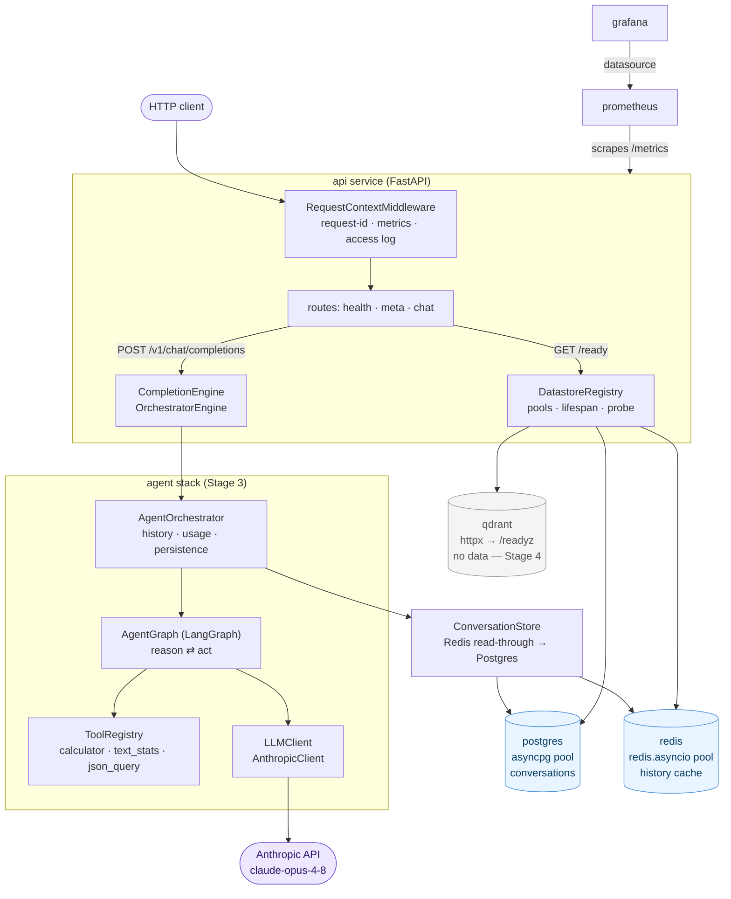
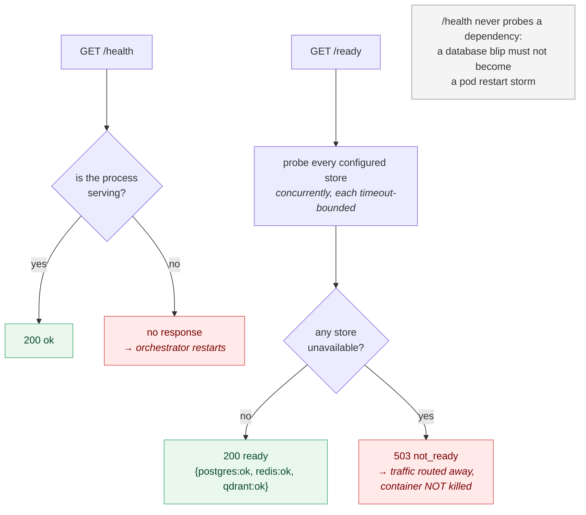
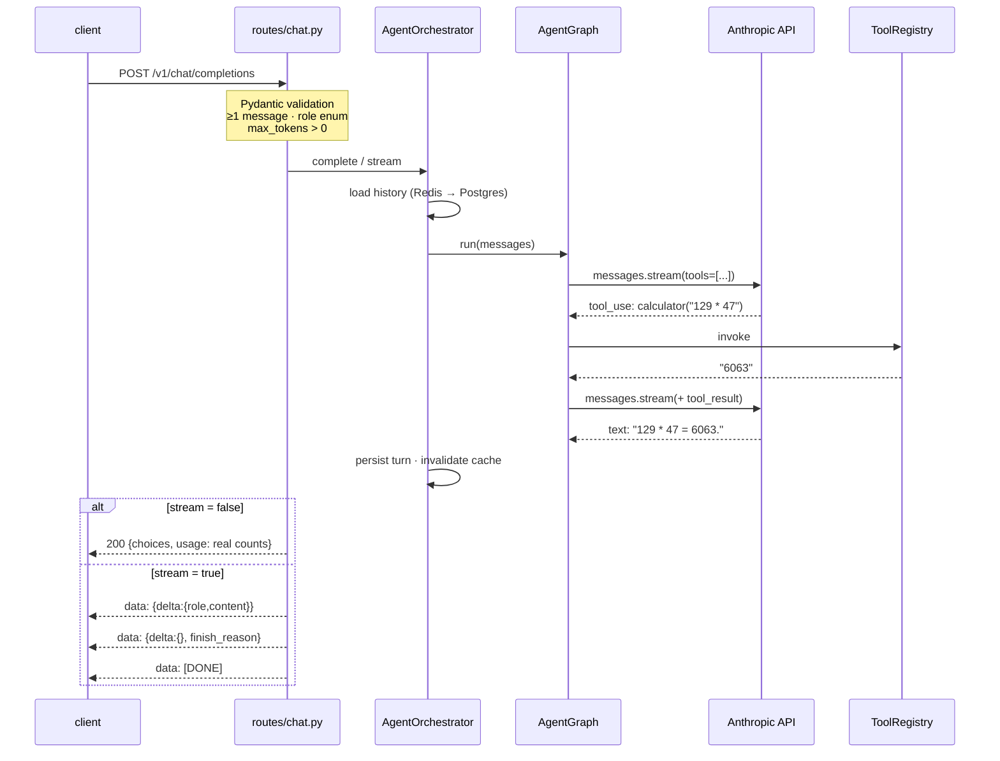
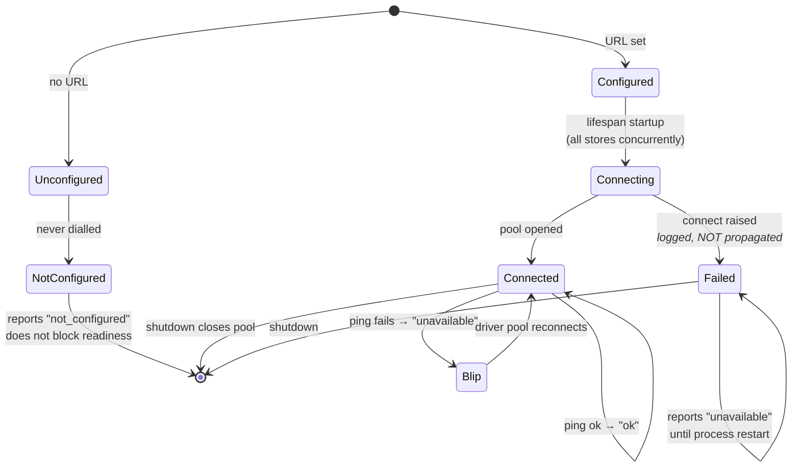
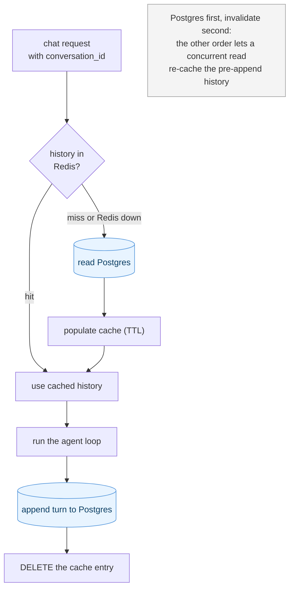

# Architecture

> **Reading rule for this document.** Everything under **Current state** exists
> and is tested today. Everything under **Planned** is **not yet implemented** —
> it is described as intent, not as built software. Do not infer capability from
> a folder existing.
>
> **This file is the source of truth.** `architecture.html` at the repo root is
> generated from it (`uv run python scripts/build_architecture.py`) and a test
> fails if the two drift. Edit this file, never the HTML. Diagrams are
> pre-rendered to inline SVG under `docs/diagrams/` — the page has no CDN and no
> JavaScript, and renders offline (ADR 0010).

**Stage 3 of 10 (Agents).** The platform today is a FastAPI service whose chat
endpoint runs a **real LangGraph agent loop against the Anthropic API**: it
reasons, calls tools, observes the results, and answers — persisting the
conversation to Postgres behind a Redis read-through cache, and reporting the
model's own token counts.

**Stage 2's `EchoEngine` is gone.** The `CompletionEngine` protocol it sat behind
is unchanged, which is what let the swap happen without redesigning the endpoint.

---

## Current state (Stage 3 — built and verified)

### Component map

`shared/` (`config` · `logging` · `observability` · `datastores` · `migrations` ·
`version`) is imported throughout the service rather than sitting in the request
path — it is left out of the diagram above to keep the flow readable.

Postgres and Redis now **hold real data**: conversation history and its cache.
Qdrant is still only reached for `GET /readyz` and holds nothing — it belongs to
Stage 4.

### The `api` service

| Endpoint | Purpose | Behaviour today |
|----------|---------|-----------------|
| `GET /health` | Liveness | `200` + service, version, environment. **Touches no datastore.** |
| `GET /ready` | Readiness | `200` `ready` + per-store checks; **`503` `not_ready`** if any configured store is unavailable |
| `GET /version` | Identity | `200` + service, version, environment |
| `GET /metrics` | Prometheus | request count + latency histogram |
| `GET /docs` | OpenAPI UI | generated by FastAPI |
| `POST /v1/chat/completions` | Chat | `200` completion, or an SSE stream when `"stream": true` |

**Request path:** `RequestContextMiddleware` assigns/propagates an
`X-Request-ID` (honouring an inbound header), binds it to a `ContextVar`, times
the request, records Prometheus metrics against the **route template** (not the
raw path, to bound label cardinality), echoes the id on the response, and emits a
structured access log.

**Error handling:** every failure returns one envelope —
`{"error": {"type", "message", "request_id"}}`. Handlers are registered for
`HTTPException` (Starlette's base, so unmatched-route 404s are covered),
`RequestValidationError` (422), and a catch-all `Exception` that logs the full
trace and returns a generic 500 that never leaks internals.

**Lifecycle:** an async `lifespan` logs `service.startup` / `service.shutdown`
and opens/closes the datastore pools.

### Liveness vs readiness

The distinction is load-bearing, not pedantry — see ADR 0005.

### The agent loop

Both transports run the **same** LangGraph graph, so streaming is a transport
choice and cannot change the answer. `reason` calls the model; `act` executes
every requested tool and feeds the results back; the loop ends when the model
answers instead of calling a tool, or when the step cap trips. See ADR 0006.

A tool that fails returns an `is_error` result rather than raising: the model
asked for something that did not work, and the useful response is to tell it so
it can correct itself — not to throw away a run the caller already paid for.

### Chat completion and streaming

SSE framing is specified in ADR 0004 and is **unchanged** from Stage 2. What
changed is `usage`: it now carries the model's own counts, summed across every
model call the run made.

### `shared/` foundation

| Module | Responsibility |
|--------|----------------|
| `config.py` | Typed `Settings` (pydantic-settings), layered profiles — see ADR 0003. `prod` refuses to boot without all three datastore URLs |
| `logging.py` | JSON formatter (`timestamp`, `level`, `service`, `environment`, `request_id`, `logger`, `message`, `exception`) + console formatter; routes uvicorn logs through one handler |
| `observability.py` | `@traced` — logs span enter/exit/duration/error; sync + async; PEP 695 typed |
| `datastores.py` | `Datastore` ABC + Postgres/Redis/Qdrant implementations and `DatastoreRegistry` — see ADR 0005 |
| `migrations.py` | Forward-only raw-SQL migration runner, applied in the lifespan — see ADR 0007 |
| `version.py` | `__version__`, kept in sync with `pyproject.toml` by a test |

### Datastore lifecycle

Startup **never raises**: an unreachable store yields a diagnosable un-ready pod
rather than a crash loop. Connects run concurrently — serialised, three dead
stores delayed `/health` by ~20s (measured), long enough to trip a liveness probe
and cause the very crash loop the design avoids.

### Conversation state and caching

Postgres owns the data; Redis only ever holds a copy. Losing Redis costs latency,
never history. Writes **invalidate** the cache rather than rewriting it —
deleting cannot disagree with Postgres, whereas computing the new value twice
can. See ADR 0008.

A request **without** a `conversation_id` is stateless and touches neither store
— the Stage 2 contract (client sends the full history) still holds exactly.

**Schema** (`migrations/0001_conversations.sql`, applied on startup):

| Table | Purpose |
|-------|---------|
| `conversations` | One row per conversation: `id`, `created_at`, `updated_at` |
| `conversation_messages` | `conversation_id` -> `position` · `role` · `content`, unique on `(conversation_id, position)`, cascading delete |
| `schema_migrations` | Applied versions; what makes the runner idempotent |

### Infrastructure (Docker Compose)

`api` (built, non-root, multi-stage), `postgres`, `redis`, `qdrant`,
`prometheus` (scrapes `api:8000/metrics`), `grafana` (Prometheus datasource
provisioned as code). Postgres and Redis gate `api` startup via healthchecks.
Grafana is on host port **3001** (3000 collides with an unrelated local
container — see CLAUDE.md).

### Quality gate

ruff (lint + format) · mypy `strict` · pytest (185 tests) · pre-commit · GitHub
Actions running the same commands, **plus** a Docker job that boots the container
against live postgres/redis/qdrant service containers and fails unless `/ready`
reports every store `ok` and the chat + SSE contract holds.

The suite is **hermetic by construction**: the `test` profile cannot construct a
real Anthropic client at all, so no test can make a paid API call regardless of
what is in the environment (ADR 0009). CI needs no `ANTHROPIC_API_KEY`.

---

## Planned — not yet implemented

Each item below is a **contract or empty folder only** today. The owning stage
builds it.

| Component | Stage | Status today |
|-----------|-------|--------------|
| `services/retrieval` — `Retriever` Protocol, `VectorStore` ABC (LlamaIndex + Qdrant) | 4 | **Not implemented.** Raises. Qdrant is reached only for `GET /readyz` and holds no data. |
| `services/monitoring` — `SpanExporter`; OpenTelemetry export, Grafana dashboards, alerts | 5 | **Not implemented.** `@traced` logs only; no OTel backend, no dashboards. |
| `services/evaluation` — `Evaluator` ABC | 6 | **Not implemented.** Raises. |
| `infrastructure/kubernetes`, `infrastructure/terraform` | 7 | **Empty placeholders.** Compose only today. |
| `services/security` — `AuthProvider`, `Guardrail` | 8 | **Not implemented.** API is entirely unauthenticated. |
| Reliability — load testing, chaos, SLOs, pool tuning, reconnect/circuit breaking | 9 | **Nothing exists.** |

### Deliberate non-goals for Stage 3

No RAG or vector search, **no authentication**, no OTel backend, no evaluation,
no Kubernetes. Pagination conventions are still deferred — no endpoint returns a
collection yet.

Within the agent stack specifically, these are deliberate omissions rather than
oversights: no prompt caching, no context compaction (a long enough conversation
will eventually exceed the context window), no per-conversation concurrency
control, and no retry or circuit breaking around the Anthropic call beyond the
SDK's own defaults. Stage 9 owns the reliability of that call.

---

## Key architectural properties

**Stable seams.** `@traced` is the tracing seam (Stage 5 makes it emit OTel spans
without touching a single call site). `get_settings()` is the config seam.
`CompletionEngine` is the model seam — **Stage 3 proved it**: `EchoEngine` was
replaced by a full agent stack and the endpoint, the SSE framing and the wire
format did not change. `LLMClient` is the new model-provider seam, and the point
at which the test profile is made hermetic. `Datastore` is the storage seam
(Stage 4 swaps Qdrant's HTTP probe for `qdrant-client`). Later stages fill seams;
they do not re-cut them.

**Fail loud.** Invalid config fails at startup — `prod` will not boot without its
datastore URLs *or its `ANTHROPIC_API_KEY`*. Unbuilt components raise
`NotImplementedError`. Errors are surfaced and logged with traces, never
swallowed. The two deliberate exceptions are both places where degrading beats
failing: a datastore that is down at boot yields an un-ready pod rather than a
crash loop (ADR 0005), and a Redis failure costs a cache hit rather than the
request (ADR 0008).

**Honest health.** `/ready` reflects reality: it dials its dependencies and says
503 when they are down. `/health` answers only "is this process alive?".

**Reproducibility.** Exact pins + committed `uv.lock` + `--frozen` installs mean
laptop, CI and image resolve identically. `link-mode = "copy"` stops uv's
cross-drive hardlink install from silently skipping a package.

**Security posture from day one.** No secrets in git (enforced by test +
`.gitignore`), credentials — including `ANTHROPIC_API_KEY` — from env only,
container runs as non-root, internal error text never reaches clients. The
calculator tool parses to an AST and walks an allow-list rather than calling
`eval`: the model is not a trusted caller, and neither is whatever talked to it.
**The API is still entirely unauthenticated** — that is Stage 8.

## See also

- [ADR 0001 — Stack selection](adr/0001-stack-selection.md)
- [ADR 0002 — Repository structure](adr/0002-repo-structure.md)
- [ADR 0003 — Configuration approach](adr/0003-configuration-approach.md)
- [ADR 0004 — Streaming transport](adr/0004-streaming-transport.md)
- [ADR 0005 — Datastore connection pooling and readiness](adr/0005-datastore-connection-pooling.md)
- [ADR 0006 — Agent loop and orchestration](adr/0006-agent-loop-and-orchestration.md)
- [ADR 0007 — Database migrations](adr/0007-database-migrations.md)
- [ADR 0008 — Conversation caching strategy](adr/0008-conversation-caching-strategy.md)
- [ADR 0009 — Hermetic LLM testing](adr/0009-hermetic-llm-testing.md)
- [ADR 0010 — Pre-rendered architecture diagrams](adr/0010-pre-rendered-diagrams.md)
- [PROJECT_STATUS.md](PROJECT_STATUS.md) — roadmap and progress
