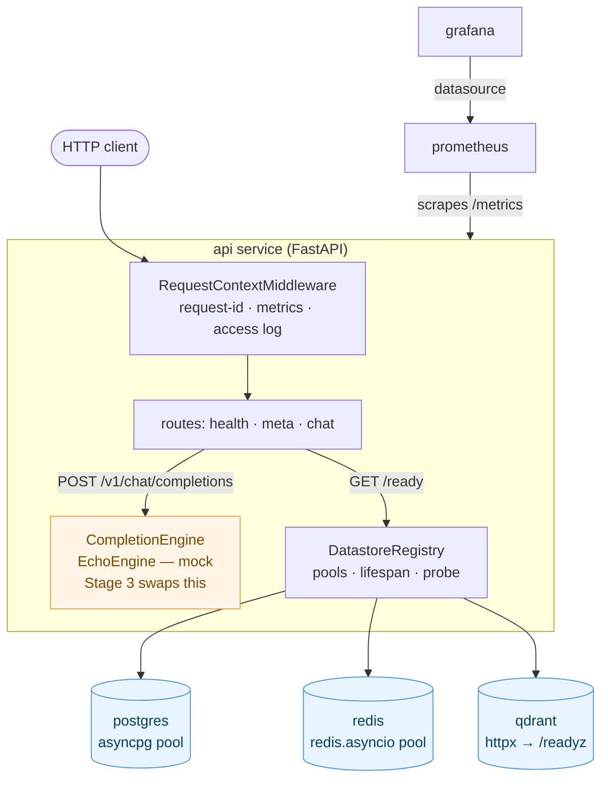
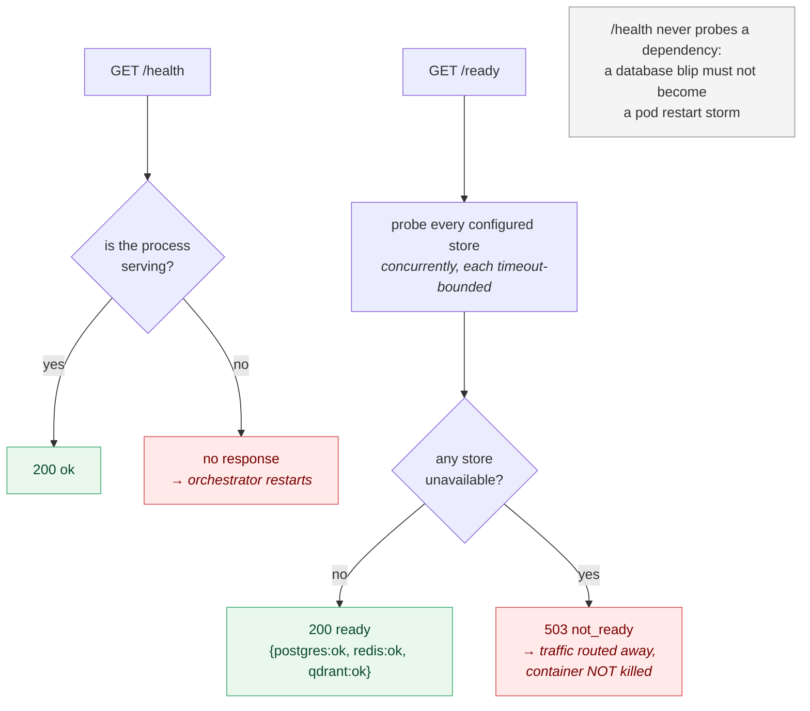
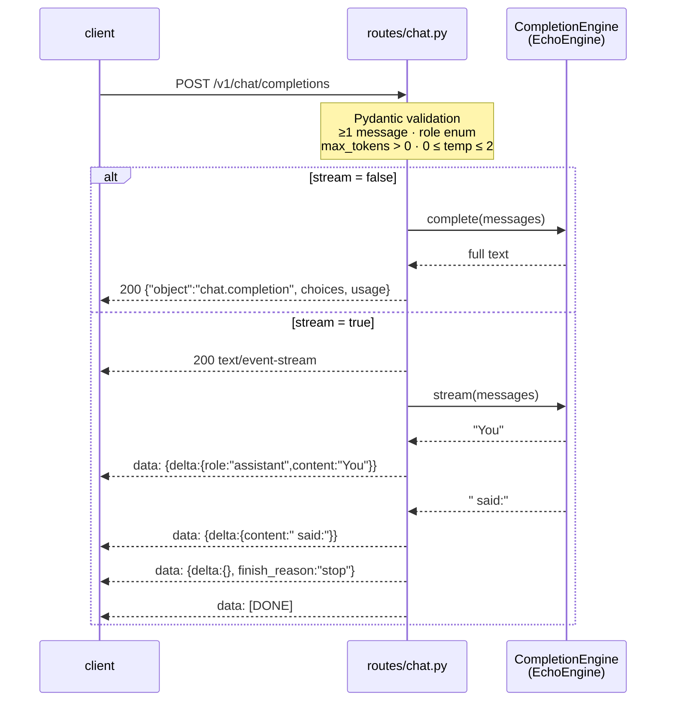
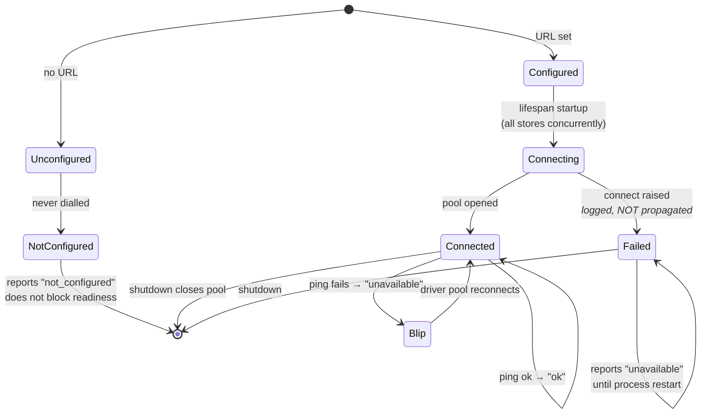

# Architecture

> **Reading rule for this document.** Everything under **Current state** exists
> and is tested today. Everything under **Planned** is **not yet implemented** —
> it is described as intent, not as built software. Do not infer capability from
> a folder existing.
>
> **This file is the source of truth.** `architecture.html` at the repo root is
> generated from it (`uv run python scripts/build_architecture.py`) and a test
> fails if the two drift. Edit this file, never the HTML.

**Stage 2 of 10 (API).** The platform today is a FastAPI service that serves a
chat completion endpoint with SSE streaming, holds pooled connections to
Postgres, Redis and Qdrant, and reports honest readiness by probing them.

**No LLM is called yet.** The chat endpoint is backed by a deterministic
`EchoEngine` behind a `CompletionEngine` protocol — the seam Stage 3 fills.

---

## Current state (Stage 2 — built and verified)

### Component map

`shared/` (`config` · `logging` · `observability` · `datastores` · `version`) is
imported throughout the service rather than sitting in the request path — it is
left out of the diagram above to keep the flow readable.

Postgres, Redis and Qdrant are **connected and probed**, but nothing is
persisted yet — no schema, migrations, cache reads/writes or vector operations.

### The `api` service

| Endpoint | Purpose | Behaviour today |
|----------|---------|-----------------|
| `GET /health` | Liveness | `200` + service, version, environment. **Touches no datastore.** |
| `GET /ready` | Readiness | `200` `ready` + per-store checks; **`503` `not_ready`** if any configured store is unavailable |
| `GET /version` | Identity | `200` + service, version, environment |
| `GET /metrics` | Prometheus | request count + latency histogram |
| `GET /docs` | OpenAPI UI | generated by FastAPI |
| `POST /v1/chat/completions` | Chat | `200` completion, or an SSE stream when `"stream": true` |

**Request path:** `RequestContextMiddleware` assigns/propagates an
`X-Request-ID` (honouring an inbound header), binds it to a `ContextVar`, times
the request, records Prometheus metrics against the **route template** (not the
raw path, to bound label cardinality), echoes the id on the response, and emits a
structured access log.

**Error handling:** every failure returns one envelope —
`{"error": {"type", "message", "request_id"}}`. Handlers are registered for
`HTTPException` (Starlette's base, so unmatched-route 404s are covered),
`RequestValidationError` (422), and a catch-all `Exception` that logs the full
trace and returns a generic 500 that never leaks internals.

**Lifecycle:** an async `lifespan` logs `service.startup` / `service.shutdown`
and opens/closes the datastore pools.

### Liveness vs readiness

The distinction is load-bearing, not pedantry — see ADR 0005.

### Chat completion and streaming

Both paths run the **same** `CompletionEngine`, so streaming is purely a
transport choice and cannot change the answer (a test asserts the streamed and
non-streamed bodies are identical). SSE framing is specified in ADR 0004.

### `shared/` foundation

| Module | Responsibility |
|--------|----------------|
| `config.py` | Typed `Settings` (pydantic-settings), layered profiles — see ADR 0003. `prod` refuses to boot without all three datastore URLs |
| `logging.py` | JSON formatter (`timestamp`, `level`, `service`, `environment`, `request_id`, `logger`, `message`, `exception`) + console formatter; routes uvicorn logs through one handler |
| `observability.py` | `@traced` — logs span enter/exit/duration/error; sync + async; PEP 695 typed |
| `datastores.py` | `Datastore` ABC + Postgres/Redis/Qdrant implementations and `DatastoreRegistry` — see ADR 0005 |
| `version.py` | `__version__`, kept in sync with `pyproject.toml` by a test |

### Datastore lifecycle

Startup **never raises**: an unreachable store yields a diagnosable un-ready pod
rather than a crash loop. Connects run concurrently — serialised, three dead
stores delayed `/health` by ~20s (measured), long enough to trip a liveness probe
and cause the very crash loop the design avoids.

### Infrastructure (Docker Compose)

`api` (built, non-root, multi-stage), `postgres`, `redis`, `qdrant`,
`prometheus` (scrapes `api:8000/metrics`), `grafana` (Prometheus datasource
provisioned as code). Postgres and Redis gate `api` startup via healthchecks.
Grafana is on host port **3001** (3000 collides with an unrelated local
container — see CLAUDE.md).

### Quality gate

ruff (lint + format) · mypy `strict` · pytest (56 tests) · pre-commit · GitHub
Actions running the same commands, **plus** a Docker job that boots the container
against live postgres/redis/qdrant service containers and fails unless `/ready`
reports every store `ok` and the chat + SSE contract holds.

---

## Planned — not yet implemented

Each item below is a **contract or empty folder only** today. The owning stage
builds it.

| Component | Stage | Status today |
|-----------|-------|--------------|
| `services/agents` — `Agent` ABC | 3 | **Not implemented.** `run()` raises `NotImplementedError`. |
| `services/orchestrator` — `Orchestrator` ABC (LangGraph); real model calls behind `CompletionEngine` | 3 | **Not implemented.** Raises. `EchoEngine` is the mock in its place. |
| Conversation state (Postgres schema/migrations), caching (Redis) | 3 | **Not implemented.** Both are connected but unused. |
| `services/retrieval` — `Retriever` Protocol, `VectorStore` ABC (LlamaIndex + Qdrant) | 4 | **Not implemented.** Raises. Qdrant is reached only for `GET /readyz` and holds no data. |
| `services/monitoring` — `SpanExporter`; OpenTelemetry export, Grafana dashboards, alerts | 5 | **Not implemented.** `@traced` logs only; no OTel backend, no dashboards. |
| `services/evaluation` — `Evaluator` ABC | 6 | **Not implemented.** Raises. |
| `infrastructure/kubernetes`, `infrastructure/terraform` | 7 | **Empty placeholders.** Compose only today. |
| `services/security` — `AuthProvider`, `Guardrail` | 8 | **Not implemented.** API is entirely unauthenticated. |
| Reliability — load testing, chaos, SLOs, pool tuning, reconnect/circuit breaking | 9 | **Nothing exists.** |

### Deliberate non-goals for Stage 2

No LLM calls, no agents, no persistence, no vector search, no authentication, no
OTel backend, no Kubernetes. Pagination conventions are deferred — no endpoint
returns a collection yet.

---

## Key architectural properties

**Stable seams.** `@traced` is the tracing seam (Stage 5 makes it emit OTel spans
without touching a single call site). `get_settings()` is the config seam.
`CompletionEngine` is the model seam (Stage 3 swaps `EchoEngine` for an
orchestrator without touching a route). `Datastore` is the storage seam (Stage 4
swaps Qdrant's HTTP probe for `qdrant-client`). Later stages fill seams; they do
not re-cut them.

**Fail loud.** Invalid config fails at startup — `prod` will not boot without its
datastore URLs. Unbuilt components raise `NotImplementedError`. Errors are
surfaced and logged with traces, never swallowed.

**Honest health.** `/ready` reflects reality: it dials its dependencies and says
503 when they are down. `/health` answers only "is this process alive?".

**Reproducibility.** Exact pins + committed `uv.lock` + `--frozen` installs mean
laptop, CI and image resolve identically. `link-mode = "copy"` stops uv's
cross-drive hardlink install from silently skipping a package.

**Security posture from day one.** No secrets in git (enforced by test +
`.gitignore`), credentials from env only, container runs as non-root, internal
error text never reaches clients.

## See also

- [ADR 0001 — Stack selection](adr/0001-stack-selection.md)
- [ADR 0002 — Repository structure](adr/0002-repo-structure.md)
- [ADR 0003 — Configuration approach](adr/0003-configuration-approach.md)
- [ADR 0004 — Streaming transport](adr/0004-streaming-transport.md)
- [ADR 0005 — Datastore connection pooling and readiness](adr/0005-datastore-connection-pooling.md)
- [PROJECT_STATUS.md](PROJECT_STATUS.md) — roadmap and progress
